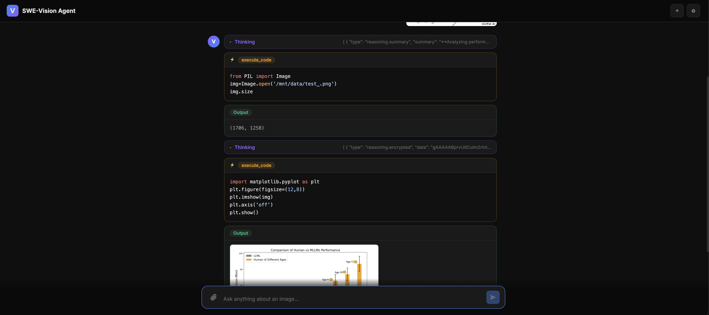
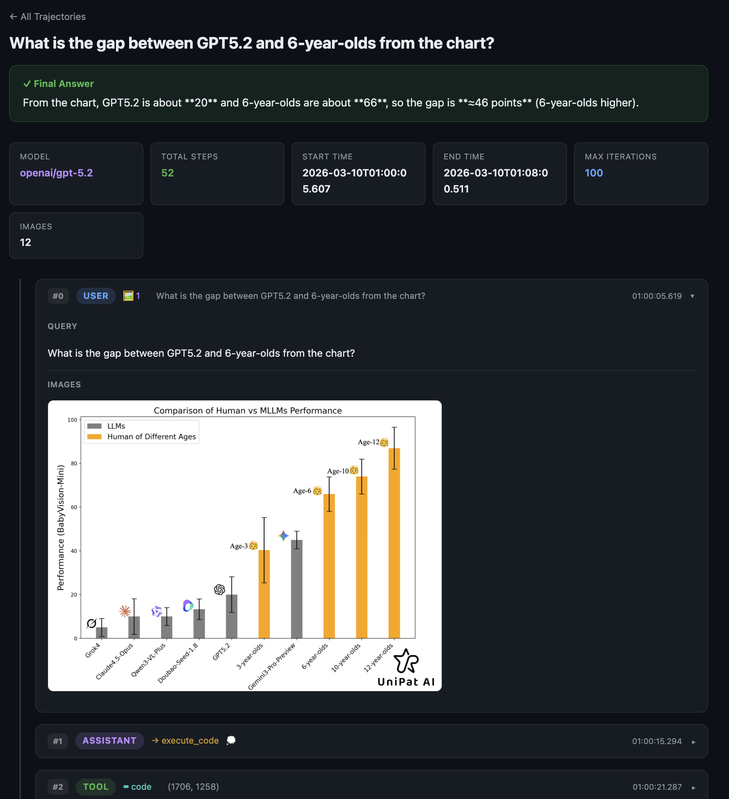

# SWE-Vision

<div align="center">
  <picture>
      
  </picture>
</div>


<div align="center" style="line-height: 1;">

[](https://github.com/UniPat-AI/SWE-Vision)
[](https://unipat.ai/blog/SWE-Vision)

</div>

An agentic VLM (Vision Language Model) framework that gives a language model optional access to a **stateful Jupyter notebook running inside a Docker container**. The agent can inspect images directly when the selected model supports vision, or iteratively write and execute Python code to process images, run computations, and produce visualizations within a sandboxed environment.

## Project Structure

```
SWE-Vision/
├── swe_vision/                  # Core library
│   ├── __init__.py              # Package exports
│   ├── config.py                # Constants, logging, tool definitions, system prompt
│   ├── kernel.py                # JupyterNotebookKernel — Docker-based Jupyter runtime
│   ├── image_utils.py           # Image encoding, MIME detection, OpenAI content parts
│   ├── file_manager.py          # NotebookFileManager — host ↔ container file sharing
│   ├── trajectory.py            # TrajectoryRecorder — saves full agent traces to disk
│   ├── agent.py                 # VLMToolCallAgent — agentic loop with tool calling
│   ├── cli.py                   # CLI entry point
│   └── eval_utils.py            # LLM judge prompt, answer extraction utilities
│
├── apps/                        # Standalone applications
│   ├── web_app.py               # ChatGPT-style web UI (Flask + SSE streaming)
│   └── trajectory_viewer.py     # Trajectory visualization dashboard (Flask)
│
├── env/                         # Docker environment (Dockerfile for the kernel)
├── requirements.txt
└── README.md
```

## Quick Start

### 1. Install dependencies

```bash
pip install -r requirements.txt
```

### 2. Set environment variables

```bash
export OPENAI_API_KEY="sk-..."
export OPENAI_BASE_URL="https://openrouter.ai/api/v1"   # custom API endpoint
export OPENAI_MODEL="gpt-4o"                            # optional default model
```

### 3. Prepare the Docker environment

The agent runs code inside a Docker container. Make sure Docker is installed and running, then place a `Dockerfile` in the `env/` directory. A minimal example:

```bash
docker build -t swe-vision:latest -f ./env/Dockerfile ./env
```


### 4. Run the agent (CLI)


We provide a script to run the agent with a single command.

Windows PowerShell:

```powershell
.\run_cli.ps1
.\run_cli.ps1 .\assets\dogs.png "How many dogs are in this image?"
```

Linux/macOS:

```bash
bash run.sh
```


You can also run the agent manually.
```bash
# Single query with an image
python -m swe_vision.cli --image photo.png "What objects are in this image?"

# Multiple images
python -m swe_vision.cli -i img1.png -i img2.png "What is the difference between these two images?"

# Text-only model: do not send image content directly to the LLM
python -m swe_vision.cli --no-model-has-vision -i photo.png "Analyze this image with Python"

# Limit successful Python code executions for one query
python -m swe_vision.cli --max-code-executions 5 -i photo.png "Count the small objects"

# Interactive mode with conversation memory
python -m swe_vision.cli --interactive --max-history 5 --summary-model gpt-4o
```


### 5. Run the Web UI

A ChatGPT-style interface with real-time streaming of the agent's reasoning, code execution, and results:

```bash
python apps/web_app.py --port 8080
# Open http://localhost:8080
```

Note: the Web UI is still available, but the newest CLI controls documented below have not all been adapted into the web interface yet.



### 6. View trajectories

Every agent run saves a trajectory (JSON + images) to `./trajectories/`. Browse them with the viewer:

```bash
python apps/trajectory_viewer.py --port 5050
# Open http://localhost:5050
```




## Architecture

```
                                User Query (+ images)
                                        │
                                        ▼
                                ┌──────────────────────┐
                                │   LLM (e.g. GPT-5.2) │◄───────────────────────┐
                                │                      │                        │
                                │   Tool Calls:        │                        │
                                │   ┌────────────────┐ │     ┌──────────────┐   │
                                │   │  execute_code  │─┼────►│Jupyter Kernel│   │
                                │   └────────────────┘ │     │  (Docker)    │   │
                                │   ┌────────────────┐ │     └──────┬───────┘   │
                                │   │    finish      │─┼──► Answer  │ (Output)  │
                                │   └────────────────┘ │            │           │
                                └──────────────────────┘    text + images ──────┘
```

**Key components:**

| Module | Responsibility |
|---|---|
| `config.py` | All constants, tool schemas, system prompt |
| `kernel.py` | Builds Docker image, starts container, manages Jupyter kernel via ZMQ |
| `agent.py` | Orchestrates the agentic loop, model vision mode, code execution budget, and tool dispatch |
| `trajectory.py` | Records every step with timestamps, code, images; saves to JSON |
| `image_utils.py` | Base64 encoding, compression, OpenAI content part builders |
| `file_manager.py` | Copies files into the Docker mount so the kernel can access them |

## CLI Options

```
usage: python -m swe_vision.cli [-h] [--image IMAGE] [--interactive]
                                [--model MODEL] [--api-key API_KEY]
                                [--base-url BASE_URL]
                                [--max-iterations MAX_ITERATIONS]
                                [--max-code-executions MAX_CODE_EXECUTIONS]
                                [--save-trajectory SAVE_TRAJECTORY]
                                [--verbose] [--quiet]
                                [--reasoning | --no-reasoning]
                                [--max-history MAX_HISTORY]
                                [--summary-model SUMMARY_MODEL]
                                [--model-has-vision | --no-model-has-vision]
                                [query]
```

| Flag | Description |
|---|---|
| `--image, -i` | Image file path (repeatable) |
| `--interactive` | Multi-turn interactive mode with rolling conversation memory |
| `--model, -m` | Model name (default: `$OPENAI_MODEL`, otherwise `gpt-4o`) |
| `--api-key` | API key override; otherwise uses `OPENAI_API_KEY` |
| `--base-url` | API base URL override; otherwise uses `OPENAI_BASE_URL` |
| `--max-iterations` | Max agentic loop iterations per query (default: `20`) |
| `--max-code-executions` | Max successful `execute_code` calls per query (default: `5`, `0` = unlimited) |
| `--reasoning / --no-reasoning` | Enable/disable extended reasoning |
| `--max-history` | **Interactive only**. Max message count before summarization (default: `5`, `0` = unlimited) |
| `--summary-model` | **Interactive only**. Model used for conversation summaries (default: same as `--model`) |
| `--model-has-vision / --no-model-has-vision` | Whether the selected model can directly inspect image inputs (default: enabled) |
| `--save-trajectory` | Custom trajectory output directory |
| `--verbose, -v` | Verbose output (default) |
| `--quiet, -q` | Minimal console output |

### Current Runtime Behavior

- If `--model-has-vision` is enabled, image content is sent to the model and the agent only uses Python execution when it materially improves the answer.
- If `--no-model-has-vision` is used, the model is treated as text-only. Images are copied into `/mnt/data/`, and the model should inspect them through the Docker-backed Jupyter kernel.
- `--max-code-executions` counts only successful `execute_code` calls. Failed code executions do not consume this budget.
- When the successful code execution budget is exhausted, the agent blocks further code execution and asks the model to finish from the available evidence.
- Interactive mode keeps recent conversation context and can summarize older history once `--max-history` is reached.

### Conversation Memory

Conversation memory is enabled in `--interactive` mode. The agent keeps the
conversation messages and the Docker-backed Jupyter kernel alive across turns.
When the number of non-system, non-summary messages reaches `--max-history`,
older context is compressed into a conversation summary before the next user
turn. Set `--max-history 0` to keep the full history without summarization.

Use `--summary-model` to choose a separate model for generating summaries. If it
is not set, the agent uses the same model specified by `--model`.

## Environment Variables

| Variable | Description | Default |
|---|---|---|
| `OPENAI_API_KEY` | API key for the LLM provider | *(required)* |
| `OPENAI_BASE_URL` | Custom API base URL | OpenAI default |
| `OPENAI_MODEL` | Default model name | `gpt-4o` |
| `VLM_DOCKER_IMAGE` | Docker image name for the kernel | `swe-vision:latest` |
| `VLM_DOCKERFILE_DIR` | Path to the Dockerfile directory | `./env/` |
| `VLM_HOST_WORK_DIR` | Host-side working directory for file sharing | `~/tmp/vlm_docker_workdir` |
| `VLM_WEB_SESSION_DIR` | Session storage for the web app | `/tmp` |

## Programmatic Usage

```python
import asyncio
from swe_vision import VLMToolCallAgent

async def main():
    agent = VLMToolCallAgent(
        model="openai/gpt-5.2",
        api_key="sk-...",
        reasoning=True,
        max_iterations=20,
        max_code_executions=5,
        model_has_vision=True,
        max_history=5,
    )
    try:
        answer = await agent.run(
            "Analyze this chart and summarize the trends",
            image_paths=["chart.png"],
        )
        print(answer)
    finally:
        await agent.cleanup()

asyncio.run(main())
```

## TODO

1. 思考轨迹输出
2. Web 版本适配

## License

MIT
