# SWE-Vision Runtime Flow

Figma/FigJam:
https://www.figma.com/online-whiteboard/create-diagram/f96f7e0d-617f-40fb-abd1-dbc9393e93d9?utm_source=other&utm_content=edit_in_figjam&oai_id=&request_id=99fc86d3-14f1-4619-afd9-4473e1fcf931

```mermaid
flowchart LR
    USER["User query and images"] --> ENTRY{"Entry point"}

    ENTRY --> CLI["CLI: python -m swe_vision.cli"]
    ENTRY --> WEB["Web UI: apps/web_app.py"]
    ENTRY --> PYAPI["Python API: VLMToolCallAgent.run"]

    WEB --> SESSION["Create web session and save uploads"]
    SESSION --> THREAD["Start background agent thread"]
    THREAD --> WEBAGENT["WebVLMAgent with SSE streaming"]

    CLI --> AGENT["VLMToolCallAgent"]
    PYAPI --> AGENT
    WEBAGENT --> AGENT

    AGENT --> INIT["Initialize trajectory recorder"]
    INIT --> MESSAGE["Build messages: system prompt plus user content"]
    MESSAGE --> IMAGE["Encode images for LLM"]
    MESSAGE --> FILES["Copy files to host work dir"]
    FILES --> HINT["Expose container paths under /mnt/data"]
    IMAGE --> LOOP["Agent loop"]
    HINT --> LOOP

    LOOP --> LLM["OpenAI-compatible chat completion"]
    LLM --> DECIDE{"Tool call"}

    DECIDE -->|"execute_code"| CODE["Parse Python code"]
    CODE --> ENSURE["Ensure Docker Jupyter kernel"]
    ENSURE --> BUILD["Build or reuse Docker image"]
    BUILD --> CONTAINER["Start container and mount work dir"]
    CONTAINER --> KERNEL["Start IPython kernel"]
    KERNEL --> EXEC["Execute code through jupyter_client"]
    EXEC --> OUTPUT["Collect stdout stderr display images"]
    OUTPUT --> TOOLMSG["Append tool result to messages"]
    TOOLMSG --> RECORDTOOL["Record tool step"]
    RECORDTOOL --> LOOP

    DECIDE -->|"finish"| ANSWER["Return final answer"]
    DECIDE -->|"no tool and stop"| ANSWER

    ANSWER --> RECORDFINAL["Record final answer"]
    RECORDFINAL --> SAVE["Save trajectory.json and messages_raw.json"]
    SAVE --> VIEWER["Trajectory Viewer"]
    SAVE --> RESPONSE["Return to CLI Web or API"]

    RECORDTOOL --> STREAM["Web SSE events"]
    RECORDFINAL --> STREAM
    STREAM --> BROWSER["Browser live updates"]

    classDef input fill:#E8F3FF,stroke:#2474B5,stroke-width:2px,color:#0B2545
    classDef app fill:#FFF7E6,stroke:#D9822B,stroke-width:2px,color:#3D2600
    classDef agent fill:#F0EAFF,stroke:#6B46C1,stroke-width:2px,color:#231942
    classDef runtime fill:#E9FBEF,stroke:#2F855A,stroke-width:2px,color:#123524
    classDef data fill:#F7FAFC,stroke:#718096,stroke-width:1px,color:#1A202C
    classDef result fill:#FFE8E8,stroke:#C53030,stroke-width:2px,color:#3B0D0D

    class USER input
    class ENTRY,CLI,WEB,PYAPI,SESSION,THREAD,WEBAGENT app
    class AGENT,INIT,MESSAGE,LOOP,LLM,DECIDE,CODE,TOOLMSG agent
    class ENSURE,BUILD,CONTAINER,KERNEL,EXEC,OUTPUT runtime
    class IMAGE,FILES,HINT,RECORDTOOL,RECORDFINAL,SAVE,VIEWER,STREAM data
    class ANSWER,RESPONSE,BROWSER result
```

