# SWE-Vision 运行流程图

Figma/FigJam:
https://www.figma.com/online-whiteboard/create-diagram/aed9cdd6-4cd3-49d3-8f9d-99aed2e5aee3?utm_source=other&utm_content=edit_in_figjam&oai_id=&request_id=63d8a56a-c50e-412c-9e39-1a276f74d580

```mermaid
flowchart LR
    USER["用户输入：文本和图片"] --> ENTRY{"运行入口"}

    ENTRY --> CLI["命令行入口：python -m swe_vision.cli"]
    ENTRY --> WEB["网页入口：apps/web_app.py"]
    ENTRY --> PYAPI["Python 调用：VLMToolCallAgent.run"]

    WEB --> SESSION["创建网页会话并保存上传文件"]
    SESSION --> THREAD["启动后台 Agent 线程"]
    THREAD --> WEBAGENT["WebVLMAgent：支持 SSE 实时推送"]

    CLI --> AGENT["VLMToolCallAgent 核心智能体"]
    PYAPI --> AGENT
    WEBAGENT --> AGENT

    AGENT --> INIT["初始化轨迹记录器"]
    INIT --> MESSAGE["构造消息：系统提示词加用户内容"]
    MESSAGE --> IMAGE["图片转为 base64 传给模型"]
    MESSAGE --> FILES["复制文件到宿主机工作目录"]
    FILES --> HINT["向模型提示容器路径：/mnt/data"]
    IMAGE --> LOOP["智能体循环"]
    HINT --> LOOP

    LOOP --> LLM["OpenAI 兼容 Chat Completion"]
    LLM --> DECIDE{"模型工具调用"}

    DECIDE -->|"execute_code"| CODE["解析 Python 代码"]
    CODE --> ENSURE["确认 Docker Jupyter Kernel 可用"]
    ENSURE --> BUILD["构建或复用 Docker 镜像"]
    BUILD --> CONTAINER["启动容器并挂载工作目录"]
    CONTAINER --> KERNEL["启动 IPython Kernel"]
    KERNEL --> EXEC["通过 jupyter_client 执行代码"]
    EXEC --> OUTPUT["收集 stdout stderr display 图片"]
    OUTPUT --> TOOLMSG["把工具结果追加回 messages"]
    TOOLMSG --> RECORDTOOL["记录工具执行步骤"]
    RECORDTOOL --> LOOP

    DECIDE -->|"finish"| ANSWER["返回最终答案"]
    DECIDE -->|"无工具且 stop"| ANSWER

    ANSWER --> RECORDFINAL["记录最终答案"]
    RECORDFINAL --> SAVE["保存 trajectory.json 和 messages_raw.json"]
    SAVE --> VIEWER["轨迹查看器"]
    SAVE --> RESPONSE["返回 CLI Web 或 API"]

    RECORDTOOL --> STREAM["Web SSE 实时事件"]
    RECORDFINAL --> STREAM
    STREAM --> BROWSER["浏览器实时更新"]

    classDef input fill:#E8F3FF,stroke:#2474B5,stroke-width:2px,color:#0B2545
    classDef app fill:#FFF7E6,stroke:#D9822B,stroke-width:2px,color:#3D2600
    classDef agent fill:#F0EAFF,stroke:#6B46C1,stroke-width:2px,color:#231942
    classDef runtime fill:#E9FBEF,stroke:#2F855A,stroke-width:2px,color:#123524
    classDef data fill:#F7FAFC,stroke:#718096,stroke-width:1px,color:#1A202C
    classDef result fill:#FFE8E8,stroke:#C53030,stroke-width:2px,color:#3B0D0D

    class USER input
    class ENTRY,CLI,WEB,PYAPI,SESSION,THREAD,WEBAGENT app
    class AGENT,INIT,MESSAGE,LOOP,LLM,DECIDE,CODE,TOOLMSG agent
    class ENSURE,BUILD,CONTAINER,KERNEL,EXEC,OUTPUT runtime
    class IMAGE,FILES,HINT,RECORDTOOL,RECORDFINAL,SAVE,VIEWER,STREAM data
    class ANSWER,RESPONSE,BROWSER result
```

